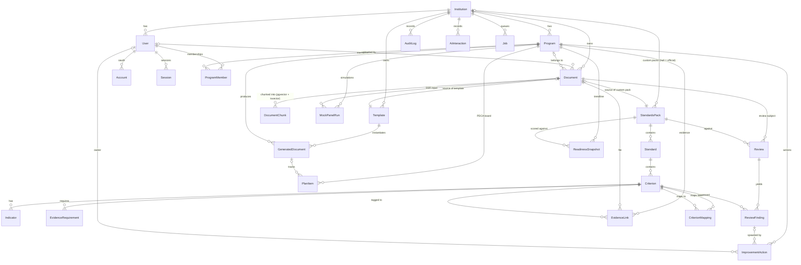

# AccreditGenius — Entity Relationship Diagram

Generated from `prisma/schema.prisma` (Phase 1). Every domain table is
scoped by `institutionId` (multi-tenant). Official standards packs are the
one exception: `StandardsPack.institutionId` is nullable — `null` marks a
globally shipped pack (NCAAA, NAQAAE, …).

## Key columns per table (abridged)

| Table | Tenant scope | Notable columns |
| --- | --- | --- |
| `User` | `institutionId` | `role` (ADMIN / QA_DIRECTOR / PROGRAM_COORDINATOR / FACULTY / REVIEWER), `passwordHash`, `locale` |
| `Program` | `institutionId` | `code`, `nameEn/nameAr`, `degreeLevel`, `nqfLevel` |
| `StandardsPack` | nullable (null = official) | `origin` OFFICIAL/CUSTOM, `country`, `code`, `version`, `sourceDocumentId` |
| `Standard` → `Criterion` → `Indicator` | via pack | bilingual `titleEn/titleAr`, NCAAA-style `code` |
| `Document` | `institutionId` | `kind`, `storageKey`, `sha256`, `ingestStatus`, `metadata` JSON |
| `DocumentChunk` | via document | `embedding vector(1536)` (HNSW), `content_tsv` generated tsvector (GIN), `page`, `headingPath`, `criterionCode` |
| `Template` | `institutionId` | `formCode` (e.g. TP-153), `schemaJson` (drives wizard + export) |
| `GeneratedDocument` | `institutionId` | `contentJson`, `status`, `exportDocxKey/exportPdfKey` |
| `Review` / `ReviewFinding` | `institutionId` | `readinessScore` 0–100, `verdict` MET/PARTIALLY_MET/NOT_MET, `citations` JSON |
| `EvidenceLink` | `institutionId` | unique (document, criterion, program) — powers the coverage heat map |
| `AuditLog` / `AiInteraction` | `institutionId` | who/when/model/`promptVersion`/`inputHash` — accreditation traceability |
| `Job` | `institutionId?` | DB-backed queue: `status`, `attempts`, `runAfter`, `lockedAt/lockedBy` |
